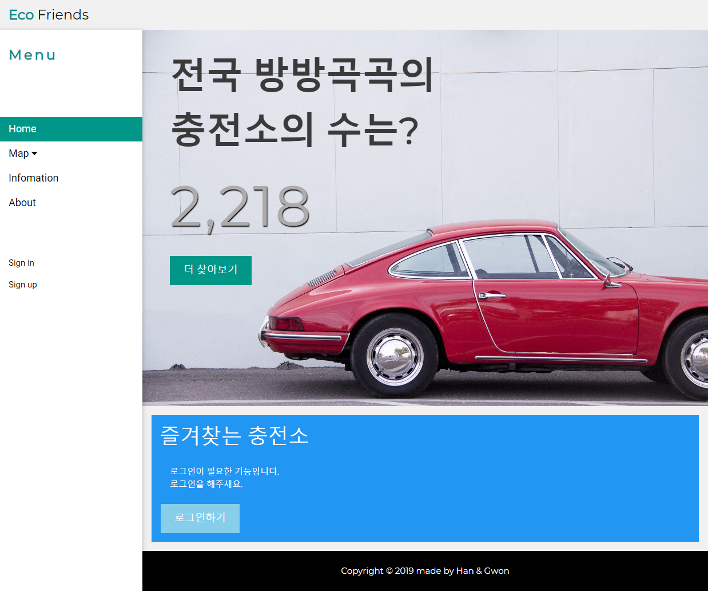
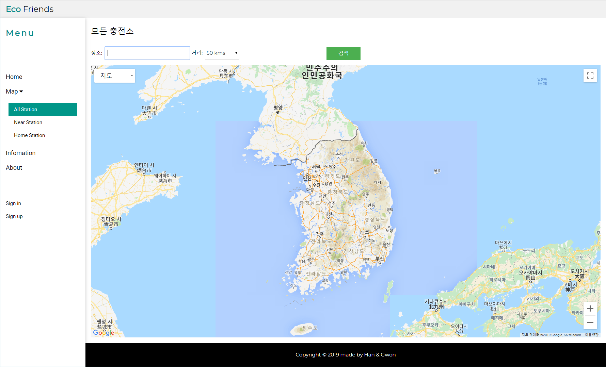
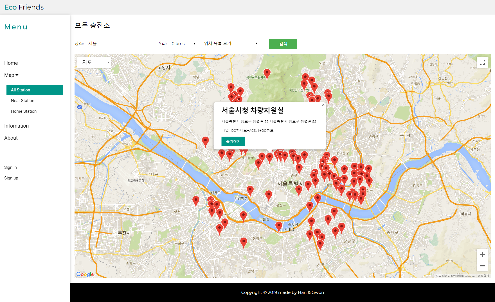
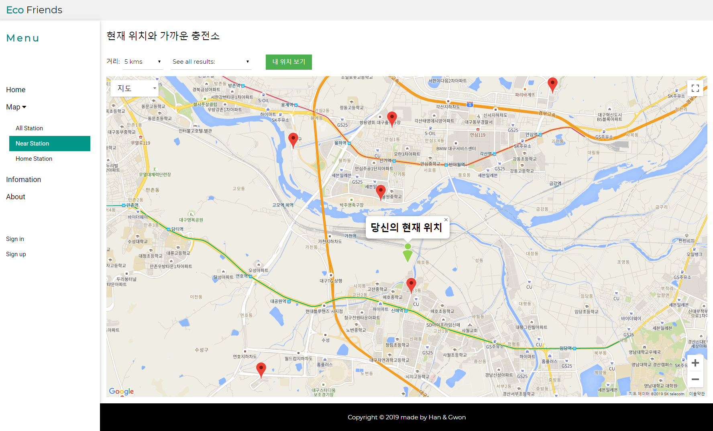

# EcoFriends

###**Link**: http://xmflr95.cafe24.com

* * *

<br><br>

<br><br>

<br><br>

<br><br>
* * *

**PHP, MySQL, JS, HTML, CSS, Google map API** /  All electric car charging stations in South Korea<br>
PHP, MySQL, JS, HTML, CSS, Google map API를 이용한 전국 전기차 충전소 위치를 볼 수 있는 지도 사이트입니다.<br>
서버는 **XAMPP, WAMP, WAMPServer** 등을 이용하시면 되겠습니다.<br>

MySQL서버에 저장할 쿼리문은 **testSql.sql** 파일을 이용하시면 됩니다.

**allStation.php, nearStation.php**의 **API KEY** 연결 부분은 **본인의 API KEY**를 적어주셔야합니다.
```js
<script async defer 
      src="https://maps.googleapis.com/maps/api/js?key=YOUR_API_KEY&callback=initMap">
</script>
```

* * *
## **PHP 7.0을 위한 수정이 이루어졌습니다.**(**Update for PHP 7.0**)
-> 기존 mysql_* 함수를 모두 mysqli_* 함수로 대체되었습니다.
* * *

많은 피드백 부탁드립니다.
